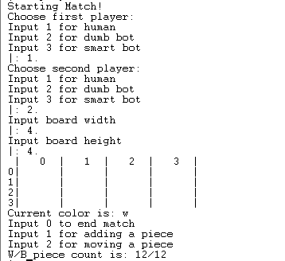
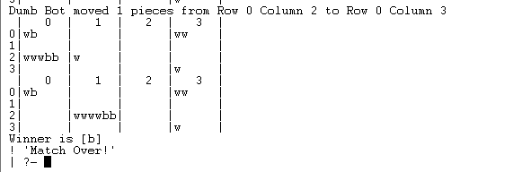

# Six making game
## Identification of the topic and group
* Practical class: 3LEIC01
* Group: Six Making_6
* Students:
    - Vlad Ryan Plavosin (67%)
    - Veronica Ramirez Marin (33%)

## Description of the game:
 Six making is a strategy game in which two people play against each other. Each of them has a maximum of 16 disks, a value that will depend on the dimensions of the board with which they decide to play. 
 
 The game is played in turns, and in each turn the players must decide whether to add a new disk to the board, or move a previously placed disk or tower to another square. This square cannot be any square, since for this move to be valid, it must not be empty, and not only this, but the moves also have a series of limitations depending on the number of disks that make up the tower to be moved. The towers have a behavior similar to the chess pieces, as follows:

    - 1 disk: Pawn
    - 2 disks: Rook
    - 3 disks: Knight
    - 4 disks: Bishop
    - 5 disks: Queen

The final objective of this game is to build a tower composed of 6 pieces, a king. The person whose color matches the color of the last disk of this tower will win.
Links used: http://www.boardspace.net/english/about_sixmaking.html 

## Game logic
#### Internal game state representation:
For the representation of this game we have created a board whose dimensions will be chosen by the players and passed as inputs by console, so the shape of the board can be square or rectangular. It has been represented as a matrix in which each quadrant contains a list, in other words, the board is a list that contains another list, which forms the rows, and whose elements are lists. This game also has a limited number of pieces per color, so it has also been necessary to create a count of available disks per color, which decreases as the pieces are placed. Finally, each move is divided into two turns, each one indicated by showing the initial of the color that corresponds to the turn on the console.

 

#### Game state visualization:
The first thing displayed at the start of the game is the menu, where you can choose the details of the gameplay. 
The first thing to enter is how you want to play, the formats are the following: human vs human, human vs dumb bot, human vs smart bot, dumb bot vs dumb bot, dumb bot vs smart bot and smart bot vs smart bot. After this, the dimensions of the board must be entered. Once this is done, the game can begin. In each turn 3 options will be shown, end match, add a piece or move a piece.
All the interactions with the players will be done through the console.
This has been implemented using display_game, which allows to print the board in a visual way, and build_board, which takes the dimensions entered and creates the board taking them into account.
#### Move validation and execution:
For each turn, the player must decide what to do. If the decision taken is to add a new piece to the board, the position where the player wants to place the piece will be checked to make sure it is empty (check_action). If the decision is to move, the player must enter the coordinates of the position where he wants to place the piece. The movement must also be verified, since depending on the number of pieces that make up the tower to be moved, a series of moves or others will be allowed. The allowed moves are as follows:

    - Pawn: moves a single square in all four directions on top of an adjoining tower
    - Rook: moves any number of squares orthogonally on the first tower in its path
    - Knight: moves in L shape on top of another tower
    - Bishop: moves any number of squares diagonally on the first tower in its path
    - Queen: moves any number of squares in all eight directions on the first tower in its path.
The valid_move_ functions are in charge of validating that the entered movement is valid.
To validate the movement it is necessary to know the type of tower to be moved, the current position of the tower and the coordinates of the new position. Each type of tower has its own evaluation, but something they all share is that there must be a piece in the selected square to be able to perform this movement, once this is verified, the check is performed for the specific piece. This is done by checking the coordinates, which allow us to determine if the movement to be made is orthogonal, diagonal, L-shaped and if the number of squares advanced is the allowed. If a move which is not allowed is attempted by the player, the program will simply reset the turn and allow the player to chose another action.
#### List of valid moves
To create the list of valid moves, the valid_moves function has been implemented. This function, using other functions, allows to obtain a list in which the moves that are valid when making a move are compiled. The operation of these functions, in summary, is that the whole board is traversed looking for squares where a piece could be placed or moved, returning the coordinates in a list.

#### End of game
A player will have won when he manages to build a tower with a total of 6 disks, as long as its color matches the color of the last piece of the tower.
This is checked with the function game_over(Tile, B), where Tile is the list containing the elements of the tower just moved and B is the board. This function checks if the size of this list is 6, if it is true, the winner is announced and the game is over.
#### Game state evaluation
The value function evaluates the moves, determining whether they are good, bad or if a winning move has been made. Depending on this evaluation, they are assigned a score that will be added to a list, which will then be added to another list containing other previously evaluated moves. This evaluation will be used for bots.
#### Computer plays
Depending on the type of bot to be used, a series of movements or others are performed. The evaluation of the moves is created as previously mentioned and a high scoring move will be chosen by the Smart bot, while the Dumb bot will simply chose a random one. The Smart bot will have the preference to move pieces whose last piece is of their color, while assigning slightly more value to those who will result in a larger tower. Apart from these moves, it will be considered an action with a medium score to add a disk, and an action with a low score to move a tower whose last piece is of the opponent's color on top of another one.
## Conclusions
A limitation found in the project is that when performing a movement, a piece should not overpass another, that is, if on the way to the final position is positioned another piece, the one that is moving should stay in this one and not overpass it, but we have not been able to make this limitation happen.
It is also worth noting a way to improve the project, and that is by eliminating the use of '.' after each imput. Many times putting it can be uncomfortable or can be something that is easily forgotten, so being able to make inputs without having to put it would improve the user's comfort.

To conclude, this has been a project that has allowed us to consolidate what we have previously learned, besides familiarizing us even more with this language.

